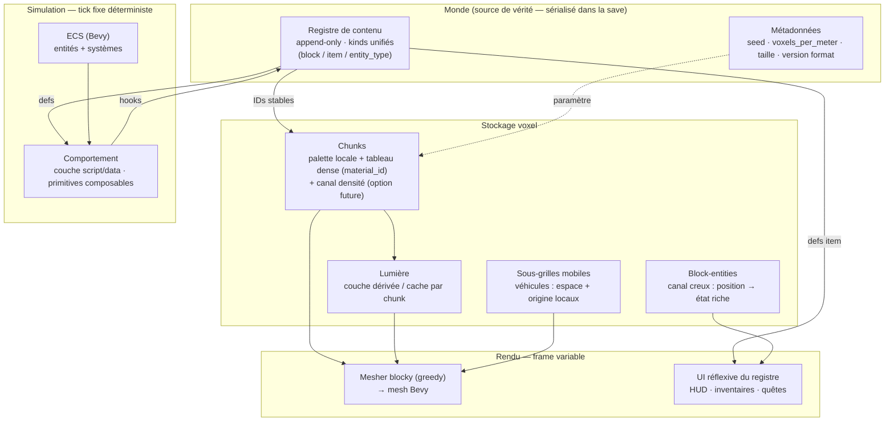

# Moteur Voxel — Design du Socle

> **Statut :** v0.1 — v0 figé pour le prototypage ; 2026-10-07 : recettes (§3.1), cycle de vie des block-entities (§3.3), forme du comportement (§3.6).
> **Nature :** ceci est un `intent/` — la source de vérité du socle. On lit **avant** d'écrire. Toute décision qui contredit ce doc doit d'abord **modifier ce doc** (avec sa justification), pas le contourner en douce dans le code.
> **Portée :** ce document décrit un **socle**, pas un jeu. Aucun système de gameplay (survie, magie, armes, quêtes…) n'est spécifié ici. Le socle est le substrat sur lequel ces systèmes se branchent sans toucher au core.

---

## 0. Intention & façon de lire ce doc

### Ce qu'on construit
Un socle voxel **modulaire, extensible, qui n'impose aucun cadre**. Un substrat sur lequel on construit à l'envie : survie *si on veut*, véhicules *si on veut*, magie *si on veut*. Le core ne connaît aucun de ces systèmes — il fournit les fondations qui les rendent tous possibles.

### Les non-négociables (invariants)
Tout le reste du doc en découle. Si une décision future viole un de ces points, c'est le doc qui a un problème, pas l'invariant.

1. **Le contenu est de la donnée, jamais du code hardcodé.** Un bloc, un item, une entité = une entrée de registre avec des composants attachés.
2. **Le monde possède son propre contenu.** La définition de ce qui existe vit *dans la save*, pas seulement dans le code.
3. **Le voxel-space est découplé du world-space.** Le monde, la physique, les entités vivent en **mètres**. La résolution voxel n'est qu'une densité.
4. **Le gameplay s'exprime en unités monde (mètres), jamais en nombre de blocs.**
5. **La simulation est déterministe** (tick fixe, seedée).
6. **On fige le data model, on laisse tout le reste mou.**

### Le garde-fou (à relire quand la tentation d'abstraire arrive)
Un socle se prouve en **portant un système concret**, pas en théorie. La cible immédiate n'est pas « l'architecture parfaite », c'est **une tranche verticale jouable** (§7). Toute abstraction qui ne sert pas cette tranche attend son tour.

### Comment lire les sections « figé »
Chaque décision du modèle de données porte un **coût de changement**. `Day-1` = ça structure le format/les types ; le changer plus tard = migration douloureuse ou resample complet du monde → on le décide **maintenant**. Le reste peut évoluer.

---

## 1. Stack technique

**Langage : Rust. Moteur : Bevy.**

Bevy est un moteur **ECS où tout est un plugin**, par philosophie — c'est l'incarnation la plus pure de « modulaire, extensible, sans imposer de cadre ». On est en **0.19** ; on assume le churn d'API à chaque release (migrations à prévoir) et les temps de compile.

**Répartition du travail :**

- **Bevy fournit** : la boucle ECS, le rendu, la fenêtre/input, le scheduling des systèmes, l'asset pipeline.
- **On construit nous-mêmes** : le **cœur voxel** (stockage de chunk, meshing, streaming). C'est *là* qu'est l'apprentissage — on ne délègue pas la partie qu'on veut comprendre. On s'appuie sur des algos de référence (greedy meshing) et on lit des crates comme `block_mesh` / `bevy_voxel_world` **comme référence**, pas comme dépendance clé-en-main.
- **Crates support** (branchées quand le besoin arrive, pas avant) : `bevy_ui` + `egui` (UI/debug), `mlua` (script — voir §5), un moteur physique (`avian`/`rapier`) plus tard.

> Rappel philosophie : on refuse la solution finie quand le but est de comprendre. Le meshing et le streaming se construisent à la main, avec de l'aide socratique si on bloque sur un concept — pas en copiant un moteur voxel entier.

---

## 2. Principes fondateurs

Les règles transverses dont dérive tout le modèle de données.

**Découplage voxel-space / world-space.** L'erreur naïve est de baker « 1 voxel = 1 mètre » partout. On ne le fait jamais. Les tailles (perso, entités, structures) sont en mètres. La résolution voxel est un facteur `voxels_per_meter` séparé. Conséquence directe : changer la résolution ne change **aucune** taille — juste la granularité du Lego.

**Gameplay en mètres.** Le rayon d'une torche = *X mètres*, pas *X blocs*. Sinon la sémantique du jeu se casse dès qu'on change la résolution. La résolution ne doit **jamais fuiter dans les règles du jeu**.

**Contenu data-driven & world-owned.** Voir §3.1. C'est le pivot entre « clone figé » et « socle à construire à l'envie » — et c'est ce qui rend possible la génération de contenu en runtime (y compris par IA).

**Composition depuis primitives.** Le comportement se compose depuis un vocabulaire de briques (« émet de la lumière », « inflammable », « flotte »…), jamais depuis du code arbitraire. C'est ce qui rend la génération de contenu *safe* et cohérente par construction.

**Déterminisme.** La simu tourne en tick fixe, reproductible depuis la seed. Worldgen reproductible, saves cohérentes, porte multi/replay ouverte.

**Fige le data model, laisse le reste mou.** Le contrat de survie du projet. §3 est dur ; §4 est mou.

---

## 3. Modèle de données — **FIGÉ**

### 3.1 Registre de contenu

**Décision.** Un **registre unique, append-only, à kinds unifiés** (`block` / `item` / `entity_type`), **sérialisé dans la save**.

- **Append-only, pas frozen.** On interdit le *réordonnancement* et la *suppression*, pas l'ajout. Ajouter une entrée avec un ID neuf jamais réutilisé ne casse rien : les anciens IDs ne bougent pas, les vieilles saves restent valides. C'est une contrainte bien plus faible que le freeze de Minecraft, et elle suffit.
- **IDs entiers stables.** Chaque entrée a un ID entier stable pour la session. Les données voxel (palette) et la persistance référencent ces IDs. Le mapping `int ↔ identifier` ne change jamais après attribution.
- **World-owned.** La définition complète d'une entrée (composants, apparence, comportement) est sérialisée **dans la save**, à côté des données voxel. La save n'est plus « quels blocs sont où » mais « quels blocs *existent* dans ce monde **+** où ». C'est ce qui permet à un contenu généré en runtime (par une IA, plus tard) d'exister sans registre statique externe.
- **Kinds unifiés.** Bloc, item, mob, item au sol, véhicule : côté ECS ce sont tous des entités ; côté contenu, une seule table avec un champ `kind`. L'item et le bloc générés par IA sortent de la même table. Pas de registres séparés qui divergent.
- **Les recettes sont une donnée de l'entrée qu'elles produisent** (ajout 2026-10-07). Une entrée peut porter zéro, une ou plusieurs recettes (entrées consommées, quantité produite, station requise éventuelle). Pas de kind `recipe` : une recette n'est pas une chose qui existe dans le monde, et la porter sur l'entrée produite rend un contenu généré **autonome** — une seule entrée à ajouter pour qu'un nouvel item existe *et* soit fabricable. Lister les recettes d'une station = parcourir le registre (même principe que la hotbar découverte).
- **L'apparence est une donnée de l'entrée, pixels compris** (ajout 2026-10-08). Une entrée de bloc nomme ses textures (une pour les côtés, et en option une pour le dessus et une pour le dessous). Le nom désigne un PNG de `assets/textures/` : c'est l'outil d'écriture, on dessine dans un vrai logiciel. Au chargement, le registre lit et garde **les pixels**, et c'est eux que la save stockera, pas le chemin : une save reste lisible sans les fichiers d'origine, et un contenu généré peut apporter ses propres pixels. Toutes les textures d'un registre ont la même taille (un texture array GPU l'exige). Une texture couvre **1 m** de surface, quelle que soit la résolution voxel (§2 : en mètres). `color` reste : couleur de secours sans texture, et couleur des items tant qu'ils n'ont pas d'apparence propre. *Coût de changement :* Day-1 pour « les pixels sont dans le registre » ; le format d'image et la façon de déclarer les faces sont mous.

**Implémentation (piste).** Arène append-only, ou `Arc<RegistrySnapshot>` swappé en RCU à chaque ajout pour garder des lectures lock-free côté systèmes ECS.

**Coût de changement :** Day-1. Structure la save et le netcode futur.

### 3.2 Représentation du voxel & du chunk

**Décision.** Un voxel = **un `material_id`** (index dans une palette). Rien d'autre. Rendu **blocky** en premier.

- **Tableau dense paletté par chunk.** Chaque chunk stocke ses voxels comme un tableau dense d'indices dans une **palette locale au chunk** (les IDs globaux du registre sont mappés via la palette). La densité mémoire est le nerf de la guerre : chaque octet compte sur des milliards de voxels.
- **Pas de champ densité baké.** Le blocky n'en a pas besoin ; réserver un octet SDF partout serait payer un coût per-voxel jamais utilisé.
- **Format de chunk versionné.** La porte du smooth reste ouverte **sans payer maintenant** : la densité deviendra un **canal optionnel par chunk** ajouté dans une version future du format (exactement comme le canal creux des block-entities). Le blocky paie zéro, le smooth est un ajout purement additif.
- **La lumière ne fait PAS partie de l'identité du voxel** (voir §3.8).

**Coût de changement :** Day-1 pour « material_id only » et le versioning du format. Le mesher (blocky→smooth) est un ajout ultérieur grâce au versioning.

### 3.3 Block-entities (canal creux)

**Décision.** Un **canal séparé, creux**, `position → état riche`, pour les rares blocs qui ont une « âme ».

Un coffre a un inventaire ; un bloc-IA peut avoir de l'état. Cet état ne peut **pas** vivre dans le tableau voxel dense (ça ferait exploser la RAM). Comme Minecraft : tableau dense pour « quel bloc », map creuse pour l'état riche des rares blocs concernés. C'est aussi ce que lit une fenêtre d'inventaire (§3.11).

**Cycle de vie** (ajout 2026-10-07). L'entrée du registre déclare l'état initial de ses instances ; poser le bloc crée l'entrée creuse à sa position, le casser la supprime. Un bloc dont l'entrée ne déclare pas d'état n'a jamais de ligne dans le canal creux. *Premier état codé (2026-10-08, établi) : `storage`, une capacité en items ; le contenu tombe au sol quand le bloc disparaît.*

**Coût de changement :** Day-1. Le split dense/creux structure le format.

### 3.4 Coordonnées & taille de monde

**Décision.** Monde **fini**. Coords de chunk en **`i32`**. World-space en **`f32`**.

- **Fini par *policy*, pas par *type*.** Un `i32` de chunk × la taille de chunk donne des milliards de blocs d'amplitude — largement au-delà du bord. Le monde fini est délimité par un simple **check de bordure**, pas par la limite du type.
- **Taille recommandée : 8192 × 8192** blocs au sol (≈ 8,2 km de côté, ≈ 67 km²) — assez pour ne jamais voir le bord en jeu normal, avec de la marge. **Hauteur ≈ 512** (ex. −128 à 384) pour caves + hauteur de construction.
- **Précision float : non-problème.** À quelques km de l'origine, un `f32` donne une précision ~millimétrique ; l'imprécision ne devient sérieuse qu'aux *millions* de blocs. Donc **pas de floating origin, pas de coords locales par région** — world-space `f32` tout bête.
- **Streaming identique à l'infini.** On charge/décharge les chunks autour du joueur exactement comme un monde infini, avec juste des bornes. On apprend la *vraie* archi de streaming, pas une version au rabais.
- **Porte v2 (infini) quasi gratuite.** Passer à l'infini = relever le check de bordure + résoudre la précision float. **Les types ne changent pas.**

**Coût de changement :** Day-1 pour le type de coords. La taille exacte est un paramètre de création (voir plus bas).

### 3.5 Résolution (voxels par mètre)

**Décision.** `voxels_per_meter` est un **paramètre de création de monde**, gelé dans la save.

- Découle du découplage voxel/world (§2). Change la granularité, pas les tailles.
- **Coût cubique** — d'où « valeurs acceptables » : diviser l'arête par 2 = ×8 données/mémoire/meshing pour le même volume ; par 4 = ×64.
  - `1 vox/m` → MC classique.
  - `2 vox/m` (÷8 volume) → sweet spot raisonnable, plus granulaire.
  - `4 vox/m` → ça pique, à ne justifier que par le gameplay.
- **Gelé dans la save** : la résolution détermine *comment* toutes les données voxel sont stockées ; la changer en cours de partie = resample du monde entier. Donc figée à la création, immuable ensuite.

**Coût de changement :** Day-1 (métadonnée de monde immuable).

### 3.6 Comportement — couche script/data composable

**Décision.** Le comportement des blocs/items/entités vit dans une **couche script/data**, **jamais en Rust natif compilé**. Le contenu est produit en **composant des primitives**, pas en écrivant du code arbitraire.

- **Pourquoi pas du natif.** On ne compile pas du Rust au runtime pour le hot-loader. Si une IA (ou un moddeur) doit fabriquer un bloc en jeu, son comportement *doit* être du data ou du script.
- **Composition depuis primitives.** L'IA/le moddeur assemble un vocabulaire de briques existantes (`emits_light`, `flammable`, `damage_on_contact`, `floats`…). Failure modes bien plus safe ; cohérence quasi gratuite, car tout est fait de morceaux qui respectent déjà les règles du monde.
- **C'est le levier n°1** de « construire à l'envie » **et** ce qui rend la génération runtime possible. Le socle modulaire pur et le rêve « IA qui génère du contenu in-game » sont **la même architecture**. Cette contrainte discipline le core dès maintenant.
- **Runtime précis : décision ouverte** (voir §5), mais la *forme* est figée : hooks événementiels + API capability-scoped.

**Forme précisée** (ajout 2026-10-07). Trois étages, du plus sûr au plus libre ; on ne monte d'un étage que quand un contenu concret ne s'exprime pas à l'étage du dessous.

1. **Propriétés** — des primitives sans logique, lues par les systèmes du moteur (`solid` aujourd'hui ; `emits_light`, `flammable`… plus tard).
2. **Règles « déclencheur → condition → effet »**, en donnée dans l'entrée. Le moteur code une fois chaque **hook** (utilisé, posé, cassé, tick, voisin modifié…), chaque condition et chaque effet (poser/retirer un voxel, faire apparaître un item, modifier l'état block-entity…) ; le contenu les combine. Des comportements que personne n'a codés naissent des combinaisons. C'est l'étage visé pour le contenu généré : une donnée se valide contre un schéma avant d'être acceptée.
3. **Script** — quand une règle ne suffit pas (boucle, calcul, état complexe). Le texte du script vit **dans l'entrée, donc dans la save**, et il est appelé sur les mêmes hooks. Garde-fous non négociables :
   - **API seulement** : le script ne voit que les fonctions que le moteur lui donne — ni fichiers, ni réseau, ni accès global au monde ;
   - **portée** : il ne lit/écrit qu'autour de son bloc, rayon en mètres ;
   - **budget** : nombre d'instructions borné par tick, coupé au-delà ;
   - **erreur isolée** : un script qui plante désactive ce comportement et le signale, le jeu continue ;
   - **déterminisme** (§2) : pas d'horloge ni de hasard libre — le hasard passe par l'API, dérivé de la seed.

**Le vocabulaire est un contrat avec la save, append-only comme le registre.** Hooks, propriétés, conditions, effets et fonctions de l'API de script ne sont jamais renommés ni supprimés, seulement ajoutés. Une save qui cite un élément inconnu de cette version du moteur est **refusée au chargement**, avec un message qui le nomme — l'ignorer changerait en silence le comportement du monde.

**La limite assumée :** un contenu, même scripté, ne fait que combiner ce que le moteur expose. Il invente de la logique, pas un nouveau rendu, un nouveau type de physique ou un nouveau genre de fenêtre. La surface du vocabulaire borne la créativité ; elle s'élargit quand un contenu concret en a besoin (§4).

**Coût de changement :** Day-1 pour le principe (comportement = data/script) et pour le contrat append-only du vocabulaire. Le runtime concret et la surface exacte du vocabulaire sont mous.

### 3.7 Entités & sous-grilles mobiles (véhicules)

**Décision.** Le monde **ne suppose pas une grille voxel globale unique**. Une structure mobile (véhicule, objet volant) est une **sous-grille de voxels détachée**, avec **son propre espace voxel local + origine locale + physique**.

- Les mods MC galèrent là-dessus depuis 10 ans (Create, Valkyrien Skies) précisément parce que le core y suppose une grille globale. On ne fait pas cette erreur : le modèle de données prévoit les sous-grilles **dès le départ** — ça ne se boulonne pas après.
- **Bonus précision :** chaque sous-grille a sa propre origine locale → ça *aide* la précision float au lieu de la casser.

**Coût de changement :** Day-1. L'hypothèse « grille unique » contamine tout si on la laisse s'installer.

### 3.8 Éclairage (invariant de data model)

**Décision.** La lumière **ne fait pas partie de l'identité canonique du voxel**. C'est une **couche dérivée / cachée par chunk**, pas une donnée d'identité.

- Le voxel canonique reste `material_id` seul (§3.2). Le niveau de lumière, s'il est stocké, l'est dans un **tableau parallèle par chunk**, dérivé et recalculable — jamais dans le tableau d'identité, jamais dans la save comme vérité (au pire un cache).
- **Ce qui est figé ici**, c'est cet invariant (« la lumière n'est pas de l'identité »). **L'algorithme reste ouvert** (voir §5) : flood-fill propagé façon MC vs. calcul différé/shader.

**Coût de changement :** Day-1 pour l'invariant (il protège la décision « material_id only »). L'algo est mou.

### 3.9 Simulation — tick fixe / frame variable

**Décision.** Logique de jeu en **tick fixe déterministe** (`FixedUpdate`, seedé) ; rendu en **frame variable**.

- Physique, ticks de bloc, IA de mob → tick fixe. Rendu, interpolation visuelle → frame variable.
- Offre : worldgen reproductible, saves cohérentes, porte multi/replay ouverte pour la v2 **sans re-architecturer**.
- Ce n'est pas du code en plus, c'est **où on range quoi** — mais ça se décide avant d'écrire la simu.

**Coût de changement :** Day-1 (discipline gratuite maintenant, cauchemar à rétrofitter).

### 3.10 Persistance (structure logique)

**Décision.** La **structure logique** de la save est figée ; le **backend de stockage** est mou (§4).

Contenu logique d'une save :
1. **Données voxel** (chunks : palette + tableau dense).
2. **Snapshot du registre** (world-owned, append-only — §3.1).
3. **Block-entities** (canal creux — §3.3).
4. **Entités** (état ECS persistant).
5. **Métadonnées de monde** : seed, `voxels_per_meter`, taille de monde, version de format.

**Coût de changement :** Day-1 pour la structure. Le moteur (region-files vs `redb`/`sled`) est un choix ultérieur.

**Rechargement du registre** (ajout 2026-10-08, jalon 5). Au chargement d'une save, les **IDs viennent de la save** et ne bougent jamais. Les fichiers de contenu du jeu (`core.ron`) sont ensuite fusionnés par identifier : une entrée qu'ils déclarent prend **leur** définition (corriger une recette ou une texture s'applique aux mondes existants) ; une entrée nouvelle est ajoutée avec un ID neuf ; une entrée que seule la save connaît (contenu généré en jeu) est gardée telle quelle, pixels compris. Une save qui contient un élément de vocabulaire inconnu est refusée (§3.6), jamais écrasée. *Coût de changement :* Day-1 (fixe ce qu'un monde garde quand le jeu évolue).

**Backend v1** (mou, 2026-10-08). Un dossier par monde : métadonnées et registre en RON, un fichier binaire par chunk **modifié** (palette + tableau dense + ses block-entities, en-tête versionné). Un chunk jamais modifié n'est pas écrit : il se régénère depuis la seed. Un chunk est écrit dès qu'il change ; joueur et inventaire périodiquement et à la fermeture.

### 3.11 UI réflexive du registre

**Décision.** L'UI est **réflexive du registre** : un slot d'inventaire tire la def de son item (icône, nom, taille de stack) du **même registre world-owned**.

- Sinon, dès qu'une IA génère un item, l'UI ne sait pas l'afficher. L'UI lit le registre comme tout le reste.
- L'inventaire d'un coffre = de l'état **block-entity** (§3.3) qu'une fenêtre lit.
- **Outillage :** `bevy_ui` (retained) pour HUD / inventaires / fenêtres de quête ; `egui` pour le debug/tooling.
- **Ce qui est mou :** thème, widgets, layout (§4).

**Coût de changement :** seul le principe « UI lit le registre » est Day-1. Les internals sont mous.

---

## 4. Zones volontairement molles

On ne les fige **pas**. On fige seulement la *forme* indiquée, et on laisse le contenu émerger en construisant.

| Zone | Forme figée | Ce qui reste libre |
|---|---|---|
| **Internals UI** | l'UI lit le registre (§3.11) | thème, widgets, layout |
| **API de script/mod** | hooks événementiels + API capability-scoped ; propriétés → règles → script (§3.6) ; vocabulaire append-only | la surface exacte (se découvre à l'usage) |
| **Worldgen** | pipeline *pluggable* | richesse : noise → biome → features peut rester bête au début |
| **Backend de persistance** | structure logique de la save (§3.10) | moteur : region-files vs `redb`/`sled` |
| **Multijoueur** | déterminisme préserve la porte (§3.9) | **tout** — c'est de la v2 |

**Principe :** fige le data model, laisse tout le reste mou.

---

## 5. Décisions encore ouvertes

À trancher, mais qui ne bloquent pas le démarrage de la tranche verticale.

**Runtime de script — `mlua` (Lua) vs. wasm (`wasmtime`/`extism`).**
- *Lua/`mlua`* : embarquement simple, excellent DX, hot-reload trivial. Idéal v1, surtout avec l'approche « composition de primitives » (l'IA sort de la donnée qui compose des briques safe, donc pas besoin de sandbox lourd contre du code hostile).
- *Wasm* : sandboxé, multi-langage, la réponse « écosystème de mods sérieux / untrusted ». Plus lourd.
- **Reco : `mlua` en v1**, wasm comme chemin de graduation si un jour on ouvre les mods à du code tiers non-confiance.

**Algorithme d'éclairage.** L'invariant est figé (§3.8), pas l'algo. **Reco : différer** — full-bright (ou skylight trivial) pour la tranche verticale, vrai éclairage ensuite.

**Dimensions de chunk.** **Reco : 32³** comme défaut (le format stocke ses propres dims → ajustable). Compromis draw-calls / coût de meshing.

**Largeur d'index de palette.** **Reco : `u16`** par voxel (65k matériaux/chunk, large) pour démarrer ; largeur adaptative (1/2/4/8/16 bits façon paletted containers MC) = optimisation mémoire ultérieure.

---

## 6. Esquisse d'architecture

**Lecture du flux :** le **Monde** possède ses métadonnées et son **registre**. Le registre attribue les IDs stables que les **chunks** stockent (via palette) et dont les fenêtres d'**UI** tirent les defs d'item. Le **comportement** (script/data) lit les defs du registre et s'y branche par hooks. La **simu** tourne en tick fixe ; le **rendu** (meshing + UI) en frame variable. Les **sous-grilles mobiles** et la **lumière** alimentent le mesher sans polluer l'identité du voxel.

---

## 7. La tranche verticale — définition de « fait »

Le premier livrable qui **prouve que les fondations tiennent**. Pas une couche d'abstraction de plus : du jouable.

**Critères d'acceptation :**
1. **Générer un chunk** depuis la seed (worldgen bête : un noise → sol/air suffit).
2. **Le mesher blocky** (greedy) transforme le chunk en mesh Bevy affiché.
3. **Poser / casser un voxel data-driven** : au moins **un vrai bloc** défini via le registre world-owned (pas hardcodé), avec sa palette qui se met à jour et le chunk re-meshé.
4. **Se déplacer** dessus : caméra + collision basique.

**Non-goals explicites de la tranche** (à ne PAS faire maintenant, pour ne pas déraper) :
- éclairage réel (full-bright OK) ;
- smooth / densité ;
- sous-grilles mobiles / véhicules ;
- script runtime complet (le « un vrai bloc » peut passer par une def data minimale, la couche script vient juste après) ;
- persistance disque (in-memory OK pour la slice) — *levé le 2026-10-08 par le jalon 5 (#8)* ;
- UI riche (un HUD debug egui suffit) — *levé en partie le 2026-10-08 par le jalon 1 (#9) : barre d'inventaire `bevy_ui`, réflexive du registre* ;
- multi.

Ces non-goals sont *prévus par le data model* (§3) mais *pas implémentés* dans la slice. C'est ça, un socle qui tient : le format les accueille, la slice ne les code pas encore.

---

## 8. Journal des décisions

| Sujet | Décision | Statut | Coût de changement |
|---|---|---|---|
| Stack | Rust + Bevy (ECS, plugin-first) | Figé | — |
| Cœur voxel | Construit main (learning) ; crates en référence | Figé | — |
| Registre | Append-only, kinds unifiés, world-owned, dans la save | Figé | Day-1 |
| Voxel | `material_id` seul, palette locale, tableau dense | Figé | Day-1 |
| Format chunk | Versionné (densité = canal optionnel futur) | Figé | Day-1 |
| Block-entities | Canal creux `position → état` | Figé | Day-1 |
| Coords | Fini par policy, chunk `i32`, world `f32` | Figé | Day-1 |
| Taille monde | 8192² × 512 (reco), param de création gelé | Figé | Day-1 |
| Résolution | `voxels_per_meter`, param de création gelé | Figé | Day-1 |
| Gameplay | En mètres, jamais en blocs | Figé | — |
| Comportement | Couche script/data, primitives composables | Figé | Day-1 |
| Recettes | Donnée de l'entrée produite, pas de kind dédié | Figé (2026-10-07) | Day-1 |
| Apparence | Textures nommées par l'entrée, pixels gardés dans le registre (donc dans la save), 1 texture = 1 m | Figé (2026-10-08) | Day-1 |
| Block-entities (vie) | État initial déclaré par l'entrée ; créé à la pose, supprimé à la casse | Figé (2026-10-07) | Day-1 |
| Forme du comportement | Propriétés → règles déclencheur/condition/effet → script ; garde-fous script | Figé (2026-10-07) | Day-1 (forme) |
| Vocabulaire | Append-only ; save à élément inconnu refusée | Figé (2026-10-07) | Day-1 |
| Sous-grilles mobiles | Prévues au data model, espace/origine locaux | Figé | Day-1 |
| Éclairage | Pas dans l'identité voxel (couche dérivée) | Figé (invariant) | Day-1 |
| Simulation | Tick fixe déterministe / frame variable | Figé | Day-1 |
| Persistance | Structure logique figée ; backend mou | Figé (structure) | Day-1 |
| Rechargement du registre | IDs de la save ; définitions des fichiers du jeu par identifier ; entrées de la save seule gardées | Figé (2026-10-08) | Day-1 |
| UI | Réflexive du registre | Figé (principe) | — |
| Runtime script | `mlua` v1 (reco), wasm en graduation | **Ouvert** | — |
| Algo éclairage | Différé, full-bright pour la slice | **Ouvert** | — |
| Dims chunk | 32³ (reco) | **Ouvert** | faible (format porte ses dims) |
| Index palette | `u16` (reco), adaptatif plus tard | **Ouvert** | faible |
| Internals UI / API mod / worldgen / backend / multi | Laissés mous | **Mou** | — |

---

## Glossaire

- **Voxel** — un point/cube de la grille 3D ; ici, un index de palette (`material_id`).
- **Chunk** — bloc de voxels (32³ par défaut) unité de stockage, meshing et streaming.
- **Palette** — table locale au chunk mappant les indices locaux vers les IDs globaux du registre (compression mémoire).
- **Block-entity** — bloc à état riche (coffre, machine) stocké dans un canal creux séparé.
- **Registre** — table de contenu append-only, world-owned, à kinds unifiés.
- **Kind** — catégorie d'entrée du registre : `block`, `item`, `entity_type`.
- **Mesher** — l'algo qui transforme les données voxel en mesh rendable (greedy pour le blocky).
- **Greedy meshing** — fusion des faces voxel coplanaires adjacentes pour réduire les triangles.
- **Densité / SDF** — champ scalaire permettant une surface *smooth* (marching cubes / dual contouring / Transvoxel). Canal optionnel futur.
- **Tick fixe** — pas de simulation à cadence constante, déterministe depuis la seed.
- **Floating origin** — technique (non nécessaire ici) recentrant le monde pour préserver la précision float loin de l'origine.
- **Hook** — événement du moteur auquel un comportement se branche (bloc utilisé, posé, cassé, tick…).
- **Primitive** — brique de comportement codée dans le moteur et composée en donnée par le contenu : propriété, condition ou effet.
- **Règle** — « quand (hook) / si (conditions) / faire (effets) », en donnée dans une entrée du registre.
- **Capability-scoped** — API dont chaque capacité est explicitement accordée (principe de moindre privilège pour les scripts/mods).